# Использование Yandex Query для анализа данных сетевой активности
belosludtzev.vanya@yandex.ru

## Цель работы

1.  Изучить возможности технологии Yandex DataLens для визуального
    анализа структурированных наборов данных

2.  Получить навыки визуализации данных для последующего анализа с
    помощью сервисов Yandex Cloud

3.  Получить навыки создания решений мониторинга/SIEM на базе облачных
    продуктов и открытых программных решений

4.  Закрепить практические навыки использования SQL для анализа данных
    сетевой активности в сегментированной корпоративной сети

## Исходные данные

1.  Программное обеспечение ОС Windows 11 Pro

2.  RStudio

3.  Интерпретатор языка R 4.5.1

4.  Доступ к экосистеме Yanex Query

## План

1.  Используя сервис Yandex DataLens настроить доступ к Yandex Query,
    который Вы использовали в ходе ранее выполненных практических работ,
    и визуально представить результаты анализа данных.

2.  Представить в виде круговой диаграммы соотношение внешнего и
    внутреннего сетевого трафика.

3.  Представить в виде столбчатой диаграммы соотношение входящего и
    исходящего трафика из внутреннего сетвого сегмента.

4.  Построить график активности (линейная диаграмма) объема трафика во
    времени.

5.  Все построенные графики вывести в виде единого дашборда в Yandex
    DataLens.

## Шаги:

``` r
sessionInfo()
```

    R version 4.5.1 (2025-06-13 ucrt)
    Platform: x86_64-w64-mingw32/x64
    Running under: Windows 11 x64 (build 26200)

    Matrix products: default
      LAPACK version 3.12.1

    locale:
    [1] LC_COLLATE=Russian_Russia.utf8  LC_CTYPE=Russian_Russia.utf8   
    [3] LC_MONETARY=Russian_Russia.utf8 LC_NUMERIC=C                   
    [5] LC_TIME=Russian_Russia.utf8    

    time zone: Europe/Moscow
    tzcode source: internal

    attached base packages:
    [1] stats     graphics  grDevices utils     datasets  methods   base     

    loaded via a namespace (and not attached):
     [1] compiler_4.5.1    fastmap_1.2.0     cli_3.6.5         tools_4.5.1      
     [5] htmltools_0.5.8.1 rstudioapi_0.17.1 yaml_2.3.10       rmarkdown_2.30   
     [9] knitr_1.50        jsonlite_2.0.0    xfun_0.53         digest_0.6.37    
    [13] rlang_1.1.6       evaluate_1.0.5   

### 1.Используя сервис Yandex DataLens настроить доступ к Yandex Query,который Вы использовали в ходе ранее выполненных практических работ,и визуально представить результаты анализа данных.

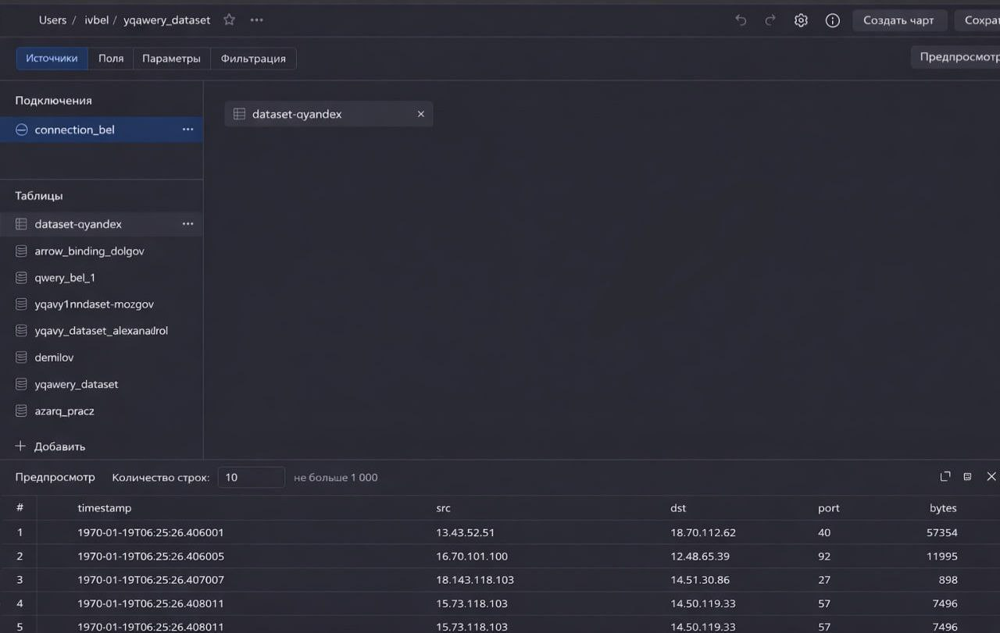

### 2.Представить в виде круговой диаграммы соотношение внешнего и внутреннего сетевого трафика.

Для создания крговой диаграммы необходимо создать новую метрику, которая
будет принимать значениние принадлежности трафика к внутреннему или
внешнему. По условию задания внутренняя сетевая адресация начианется с
12./13./14., зная это создаем новое поле измерения подчиняющееся
следующему правилу:

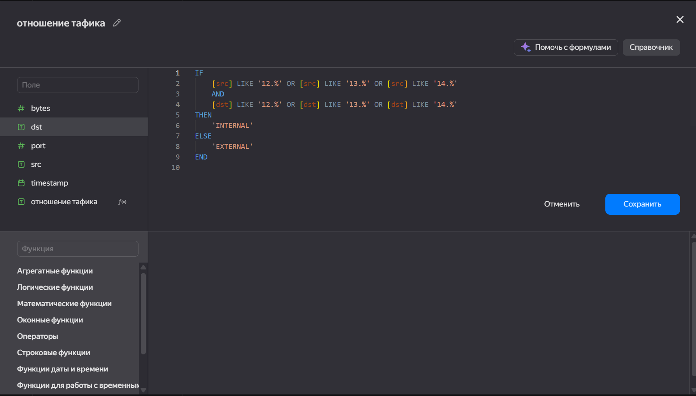

Для данного поля создаем счетчик

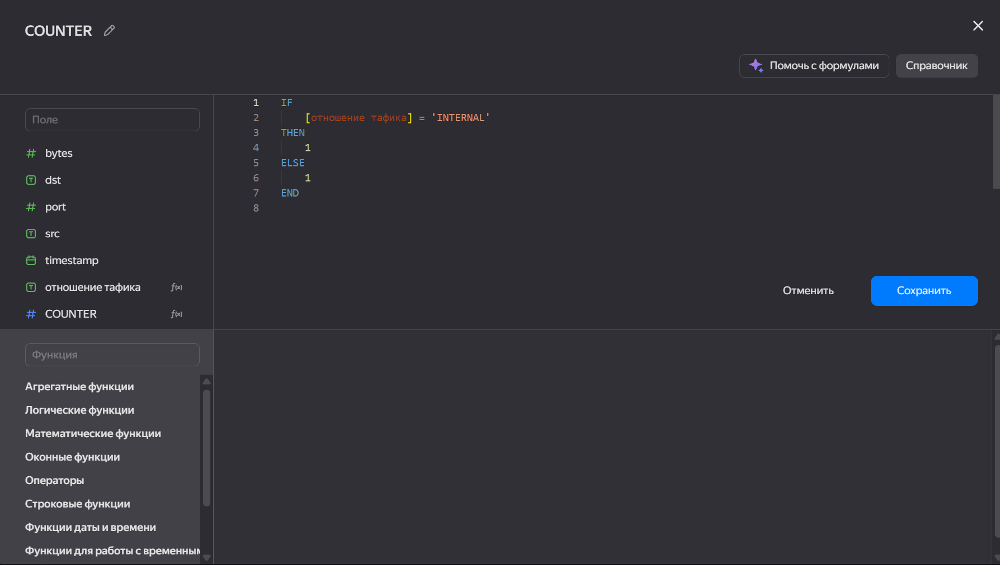

На основании полученного поля строим круговую диаграмму:

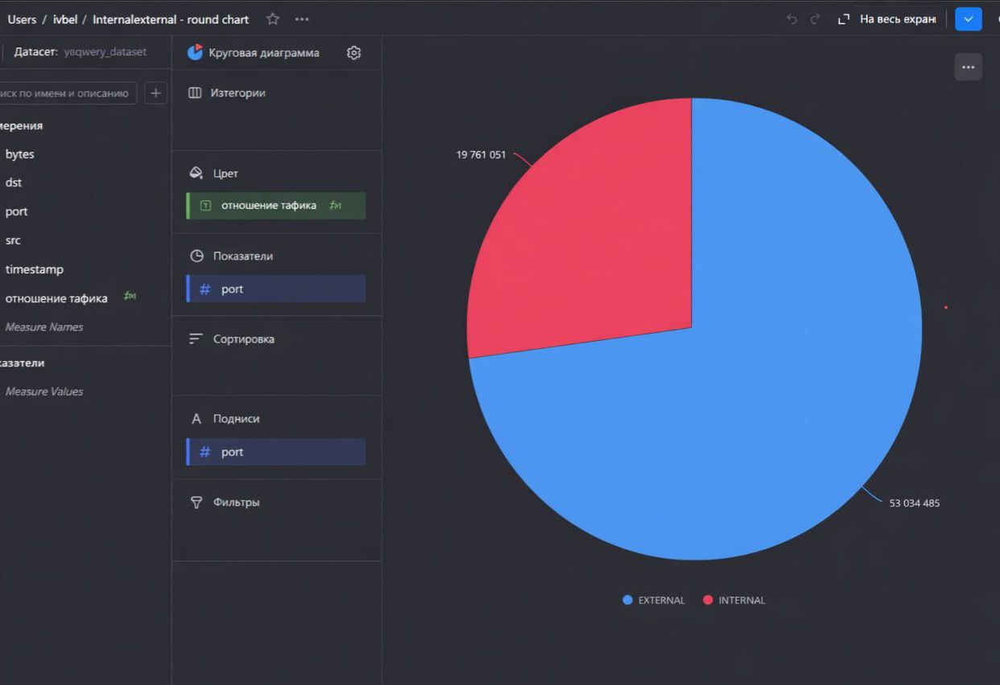

### 3.Представить в виде столбчатой диаграммы соотношение входящего и исходящего трафика из внутреннего сетвого сегмента.

Для создания столбчатой диаграммы необходимо создать новую метрику,
которая будет принимать значениние принадлежности трафика к внутреннему
или внешнему. По условию задания внутренняя сетевая адресация начианется
с 12./13./14., зная это создаем новое поле измерения подчиняющееся
следующему правилу:

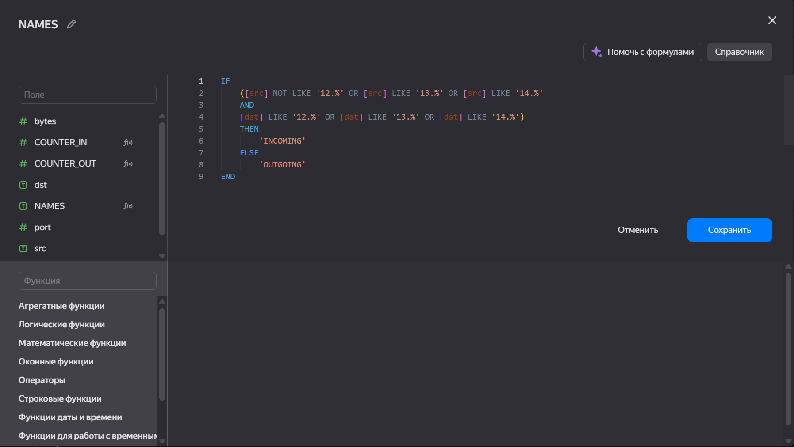

Так же на основе этого правила создадим два счетчика:

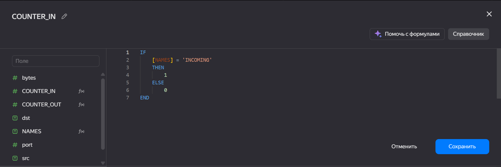

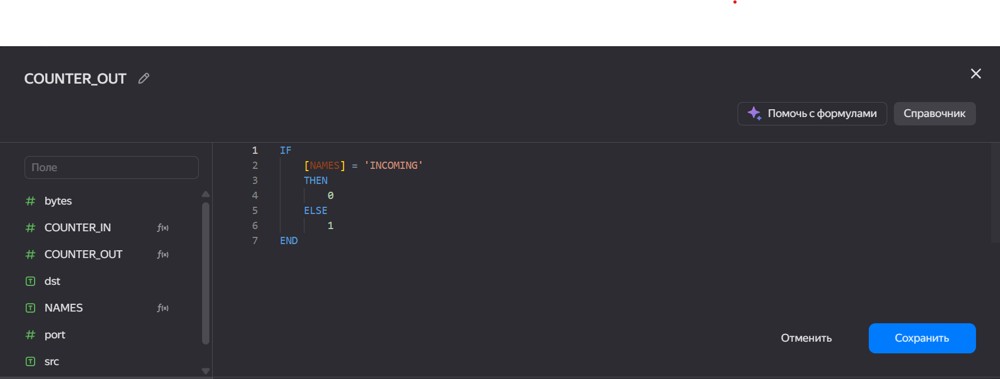

Итоговая диаграмма имеет следующий вид: 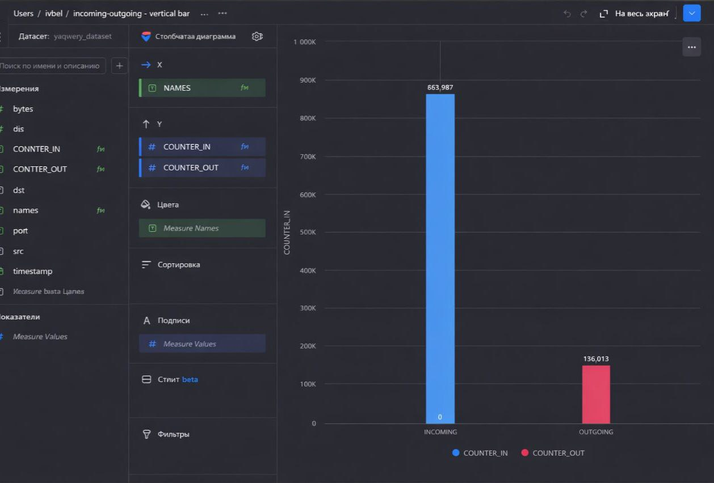

### 4.Построить график активности (линейная диаграмма) объема трафика во времени.

Для создания линейной диаграммы необходимо создать несколько метрик.
Первая из них будет приводть число формата timstamp в дробное число
обозначающее время в микросекундах с момента начала отсчета. Формула
данной метрики будет иметь слудующий вид:

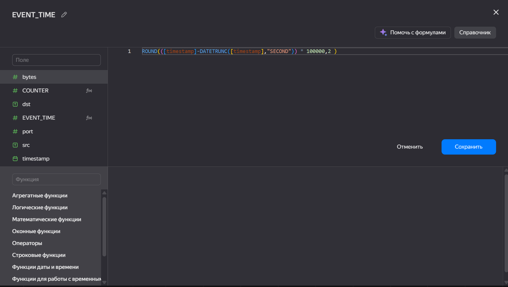

На основе данного измерения выведим счетчик значений в каждый момент
времени. Счетчик имеет следующий вид:

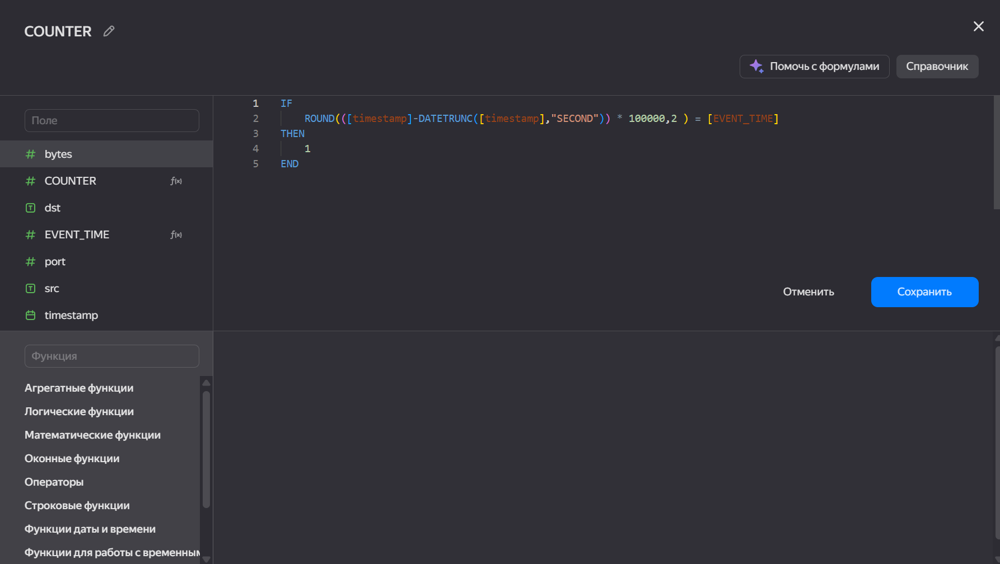

Получаем итоговую линейную диаграмму

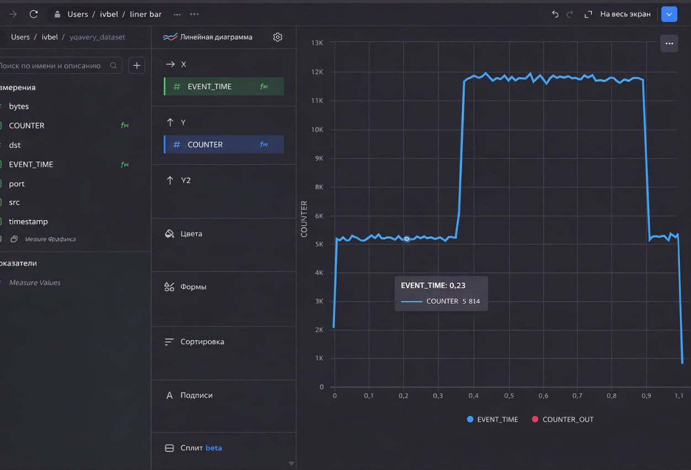

Из полученных чартов формируем дашборд:

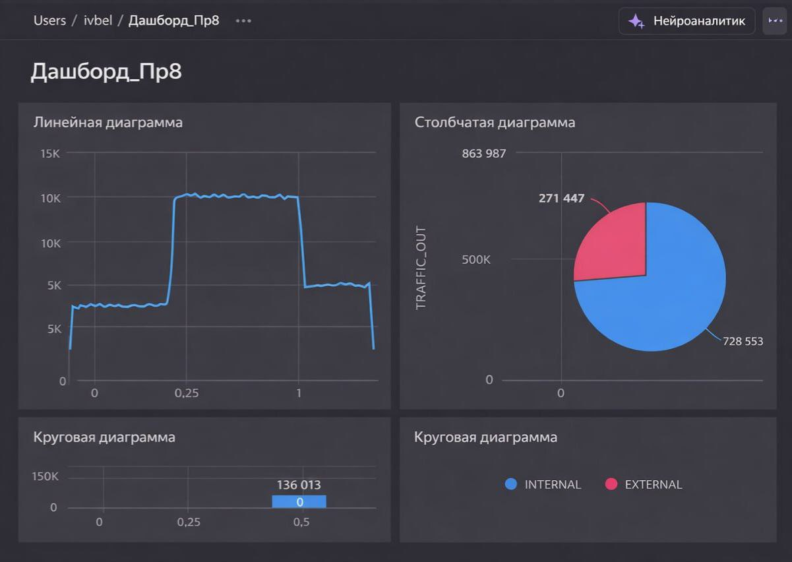


## Оценка результата

В рамках практческой работы были изучены возможности Yandex Datalens для
визуализации данных.

## Вывод

В практической работе были изучены возможности технологии Yandex
Datalens для анализа структурированных наборов данных и получены навыки
создания визуализаций в данной системе.
